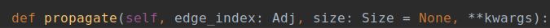

# abstract
 在刷代码的时候遇到的一些Python技术，不懂得记录下来！

# 语法细节

## 函数参数中的“:”

这里的冒号（:）是显式的给参数指定*建议类型（type hints）*，但是即使传入的实际参数与建议参数不符，也不会报错。

举个例子：

```python
def param_colon_exp(p: int = 3):
    print(p)
param_colon_exp(2)
param_colon_exp()
=> 2
=> 3
```
这里指定参数p为int类型，且默认值为3

 type hints 有很多别的类型，此处主要说Union，Optional， 因为对于python 用到的也比较多

Union 是当有多种可能的数据类型时使用，比如函数有可能根据不同情况有时返回str或返回list，那么就可以写成Union[list, str]
Optional 是Union的一个简化， 当 数据类型中有可能是None时，比如有可能是str也有可能是None，则Optional[str], 相当于Union[str, None]. **注意** 和 函数有默认参数None有区别，有区别，有区别，不可省略默认参数，如下示例：
原始：`def func(args = None):`
错：`def func(args:Optional[str]) -> None:`
对：`def func(args:Optional[str] = None) -> None:`
type hints 还可以自定义类型等等.

## 函数参数中的“->”
同理还有  `->` 表示建议函数的返回类型 ，同样也不会因为返回类型与建议类型不符而报错。
```python
def param_arrow_exp(func: callable, p: int = 3) -> int:
    l = [1,2,3]
    l.append(p)
    a = func(l)
    return a
c = param_arrow_exp(max, 2)
print(c)
=> 3
```
## for x in y or z:
If y evaluates to True, the for-loop will iterate through it,Otherwise, it will iterate through z.

```python
>>> y = [1, 2, 3]
>>> z = [4, 5, 6]
>>> for x in y or z:
...     print x
...
1
2
3
>>> y = [] # Empty lists evaluate to False in Python
>>> for x in y or z:
...     print x
...
4
5
6
>>>
```