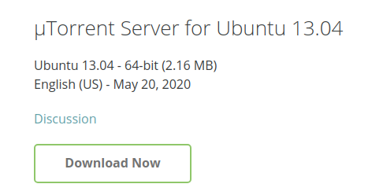

# Abstract

之前一直以为Ubuntu无法下载[六维](http://bt.neu6.edu.cn/forum.php)上的资源，原来可以，而且不难。

# 下载 uTorrent（Web UI）
官网下载地址:http://www.utorrent.com/downloads/linux
由于我的系统都是18.04的，这个软件貌似只支持12.04+  

下载这个文件：


# 安装
把下载来的压缩包解压，然后运行里面的 utserver ，打开浏览器输入http://localhost:8080/gui/，帐户为 admin ，密码为空，就可以登录uTorrent Web 控制台了。

# 下载之前
在下载前，你必须要在 uTorrent Serve 的根目录下手工创建一个名为 utserver.conf 的配置文件，配置文件内容如下：
```
ut_webui_port 8080
dir_active /home/
dir_torrent_files /home/tfiles/
bind_port 37455
token_auth_disable
```

如上就可以愉快的在Ubuntu下下载六维上的资源了。