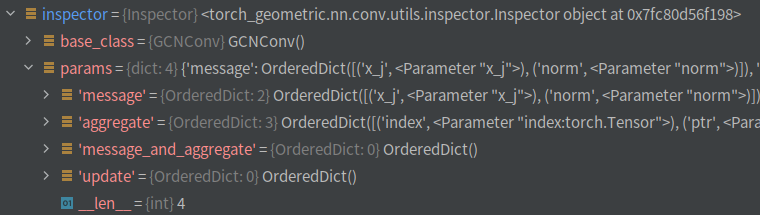
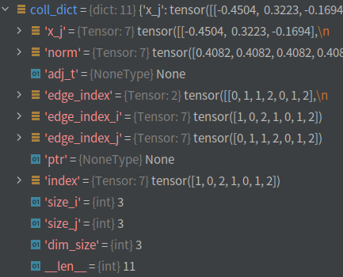

# abstract
我打算从最简单的GCN入手，理解Pytorch Geometric包的MessagePassing类。  
参考教程：[INTRODUCTION BY EXAMPLE](https://pytorch-geometric.readthedocs.io/en/latest/notes/introduction.html)
Graph Convolution 操作通常被表示为 neighborhood aggregation 或者 message passing的scheme.  
With <span>$\mathbf{x}^{(k-1)}_i \in \mathbb{R}^F$<span> denoting node  features  of node <span>$i$<span> in layer <span>$(k−1)$<span> and  

<span>$\mathbf{e}_{j,i} \in \mathbb{R}^D$<span> denoting (optional) edge features from node j to node i,

MessagePassing的基本格式如下：

<div>
$$
\mathbf{x}_i^{\prime} = \gamma_{\mathbf{\Theta}} \left( \mathbf{x}_i,
        \square_{j \in \mathcal{N}(i)} \, \phi_{\mathbf{\Theta}}
        \left(\mathbf{x}_i, \mathbf{x}_j,\mathbf{e}_{j,i}\right) \right)
$$
<div>

where $\square$ denotes a differentiable, permutation invariant function, e.g., sum, mean or max, and $\gamma$ and $\phi$ denote differentiable functions such as MLPs (Multi Layer Perceptrons).

在MessagePassing的基本方法中，message() = $\phi$ and update() = $\gamma$.

# MessagePassing 的特殊入口
```python
special_args: Set[str] = set([
    'edge_index', 'adj_t', 'edge_index_i', 'edge_index_j', 'size_i',
    'size_j', 'ptr', 'index', 'dim_size'
])
```
这个暂时不知道是做什么的

#  `__init__ `
```python
def __init__(self, aggr: Optional[str] = "add",
    flow: str = "source_to_target", node_dim: int = -2):
    super(MessagePassing, self).__init__()

    self.aggr = aggr
    assert self.aggr in ['add', 'mean', 'max', None]

    self.flow = flow
    assert self.flow in ['source_to_target', 'target_to_source']

    self.node_dim = node_dim
    ...
```
主要参数：aggr， flow，node_dim
其中，flow必须从`['add', 'mean', 'max', None]` 里选，flow必须从 ` ['source_to_target', 'target_to_source']` 里选。

```python
    self.inspector = Inspector(self)
    self.inspector.inspect(self.message)
    self.inspector.inspect(self.aggregate, pop_first=True)
    self.inspector.inspect(self.message_and_aggregate, pop_first=True)
    self.inspector.inspect(self.update, pop_first=True)
```
这一块代码要仔细探索下。
```python
    def inspect(self, func: Callable,
                pop_first: bool = False) -> Dict[str, Any]:
        params = inspect.signature(func).parameters
        params = OrderedDict(params)
        if pop_first:
            params.popitem(last=False)
        self.params[func.__name__] = params
```
- 输入一个可以调用的函数`func`，以及是否推出第一个参数的选项`pop_first`.
- `params` 为一个Dict，为`func`的参数列表
- 最终赋予inspector调用的一个实例参数列表，key为函数名，value为该函数的参数。比如` self.inspector.inspect(self.message)` 最终返回一个key为 message ， value为 message的参数（x_j, norm）的OrderedDict.  

最终inspector返回的结果如图：


```python
self.__user_args__ = self.inspector.keys(
            ['message', 'aggregate', 'update']).difference(self.special_args)
```
`self.inspector.keys()`保存`self.inspector`中保存函数参数的所有参数名（OrderedDict的key值）。
因此，
```python
self.__user_args__ = self.inspector.keys(
            ['message', 'aggregate', 'update']).difference(self.special_args)
```
保存，用户自己定义的`message`, `aggregate`, `update`中的参数，区别于默认参数，比如这里GCN多出来的用户自定义参数为`{'norm', 'x_j'}`.  
同理，` self.__fused_user_args__ ` = `set()`(没有用户自定义的参数)。

```python
# Support for GNNExplainer.
self.__explain__ = False
self.__edge_mask__ = None
```
这两个配置参数，暂时不表。

# `propagate func`
GNN的主函数一般会调用`self.propagate(.)`，主要用来给`self.message()` 和 `self.update()`传递参数。

在GCN的例子里，`self.propagate(.)`是这样调用的：
```python
self.propagate(edge_index, x=x, norm=norm)
```
这里的参数一定要保证`self.message()`和`self.update()`参数的值要传进去。我理解是一个都不能少！

进入`self.propagate(.)`函数内部，
```python
size = self.__check_input__(edge_index, size)
```
用来检查`edge_index`的维度、大小、参数类型, 如果显示指出了`size`则返回`size`??
这里感觉是*无用功*啊？？


```python
coll_dict = self.__collect__(self.__user_args__, edge_index, size,
                                         kwargs)
```
下一步，收集参数的值，首先是用户自定义的参数`self.__fused_user_args__`，在这里是`x_j`和`norm`。然后是如下的参数：

```python
out['adj_t'] = None
out['edge_index'] = edge_index
out['edge_index_i'] = edge_index[i]
out['edge_index_j'] = edge_index[j]
out['ptr'] = None # 稀疏邻接矩阵需要
out['index'] = out['edge_index_i']
out['size_i'] = size[1] or size[0]
out['size_j'] = size[0] or size[1]
out['dim_size'] = out['size_i']
```

最终`coll_dict`为：


<!-- <object type="image/svg+xml" data="xxx.svg"></object> -->
<!-- {{ readFile "http://www.w3.org/2000/svg" }} -->
<!--  -->
<!-- <svg xmlns="http://www.w3.org/2000/svg" icon="tags"> -->

`msg_kwargs = self.inspector.distribute('message', coll_dict)`
 进入到函数内部，func_name = 'message', kwargs = coll_dict.
 用来给`self.message()`赋予相应的参数。

 下一步就是执行`self.message()`，在本例（GCN）中，`x_j`是 7x3的，代表有7个邻居（边），每个邻居的embedding是3维的。

然后将`self.message()`的输出，输入给`self.aggregate()`
 ```python
 aggr_kwargs = self.inspector.distribute('aggregate', coll_dict)
out = self.aggregate(out, **aggr_kwargs)
 ```
 这里的是有各种`torch.scatter()`操作：(本例中是Scatter Add)
 ```python
 scatter(inputs, index, dim=self.node_dim, dim_size=dim_size,
                           reduce=self.aggr)
 ```

然后再把`self.aggregate()`的输出，输入给self.update()，并最终返回结果。
```python
update_kwargs = self.inspector.distribute('update', coll_dict)
return self.update(out, **update_kwargs)
```
 


# `aggregate func`

```python
def aggregate(self, inputs: Tensor, index: Tensor,
                  ptr: Optional[Tensor] = None,
                  dim_size: Optional[int] = None) -> Tensor:
```
Aggregates messages from neighbors as  <span>$\square_{j \in \mathcal{N}(i)}$<span>. Takes in the output of message computation as first argument and any argument which was initially passed to `propagate`. By default, this function will delegate its call to scatter functions that support "add", "mean" and "max" operations as specified in :`__init__`by the :obj:`aggr` argument.