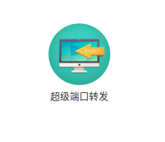

# abstract
一直想从宿舍或家里通过SSH连接所里的电脑，经过一番探索，步骤如下。

# 安装SSH
## 检查SSH服务是否已启动
```sh
ps -e | grep ssh
```
如果出现`sshd`这条进程，则说明ssh-server已启动，`ssh`表示ssh-client已启动。

```sh
  822 ?        00:00:00 sshd
 1430 ?        00:00:00 ssh-agent
 7305 ?        00:00:00 ssh-agent
14732 ?        00:00:00 sshd
14806 ?        00:00:00 sshd
15368 ?        00:00:00 sshd
15434 ?        00:00:00 sshd
```
## 安装SSH服务
安装SSH的客户端和服务端：
```sh
sudo apt-get install openssh-client
sudo apt-get install openssh-server
```
启动后通过以下指令判断SSH服务是否正确启动：
```
ps -e | grep ssh
```

# 端口转发
这一步需要操作路由器实现，原则上是将内网ip的端口（比如ssh需要用的22端口），转发给外网的静态ip，这样如果从外网访问指定ip的指定端口，就会降临在内网ip的指定端口上。

## 登录路由管理页面
登录路由器的管理网站（我这里是极路由：http://hiwifi.com/）


## 安装智能插件
选择左边栏的【智能插件】选项卡。


查找插件，安装【超级端口转发】。


关于【超级端口转发】有详细的功能介绍：
### 功能介绍
类别： 极客工具 / 应用作者： HiWiFi / 当前版本： 0.3.0 / 发布时间： 2016-04-08
设置说明:

#### 端口转发设置举例

外部端口: 4000

内部IP地址: 192.168.199.102

内部端口: 80

如果端口转发生效，访问 http://10.10.95.10:4000/ 将会被映射到内网 192.168.199.102 这台服务器的 80 服务

简单而言，超级端口转发实现了在外面能直接访问家里路由器以及所连设备功能，用户可以发挥自己的想象力，实现
  1.能够在外管理设置路由器
  2.访问家里搭建的私人服务器
  3.访问家里网络摄像头
  4.各种玩法，有待您的补充和分享
技术上，端口转发定义了广域网服务端口和局域网网服务器之间的映射，所有对这个广域网服务端口的访问将会被重定位给通过IP地址制定的局域网服务器。


#### 安装步骤
  1.安装本插件（超级端口转发）
  2.在参数配置上，点击"增加一条转发规则"
  3.填写规则信息，包括外部端口（例如 8008）、内部IP（例如 192.168.199.1）、内部端口（例如 80）
  4.完成后点击"下一步"
  5.检测外网IP和WAN口IP是否一致，如不一致则您的组网方式可能不支持该功能，建议卸载或者咨询您的网络管理员
  6.通过第3步填写的信息访问家里设备，例如 外网IP如果是20.134.11.34的话，则20.134.11.34:8008 便可访问内部 192.168.199.1:80


#### 设置说明

端口转发设置举例：
  外部端口: 4000
  内部IP地址: 192.168.199.102

  内部端口: 80

  如果端口转发生效，访问 WAN口 IP http://192.168.15.74:4000/ 将会被映射到内网 192.168.199.102 这台服务器的 80 服务


#### 有趣玩法

 1.远程进入路由器后台管理

 2.远程查看家里摄像头


#### 常见问题

1.无法访问内部机器？建议按照下述一项或者多项检查解决
A，确认外网IP和WAN口IP是否一致，如不一致则您的组网方式可能不支持该功能，建议卸载或者咨询您的网络管理员
B，外部端口尽量避免使用一些常用端口，例如80
C，确定内网机器的IP正确，如果访问是极路由，则大多为 192.168.199.1，如果是内部其他设备，建议进入极路由后台确认
2.为了安全起见，如暂不使用，建议临时关闭该插件功能

## 为内网开通端口转发
具体到我的case，就是如下

添加一条转发规则，将ubuntu的ip和端口号转发到外网的ip和22端口即可。
DMZ主机是说明意思，尚不太清楚。